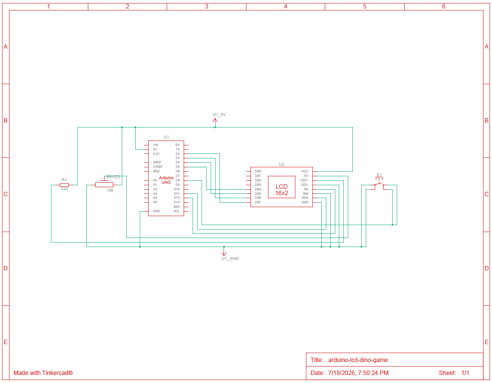
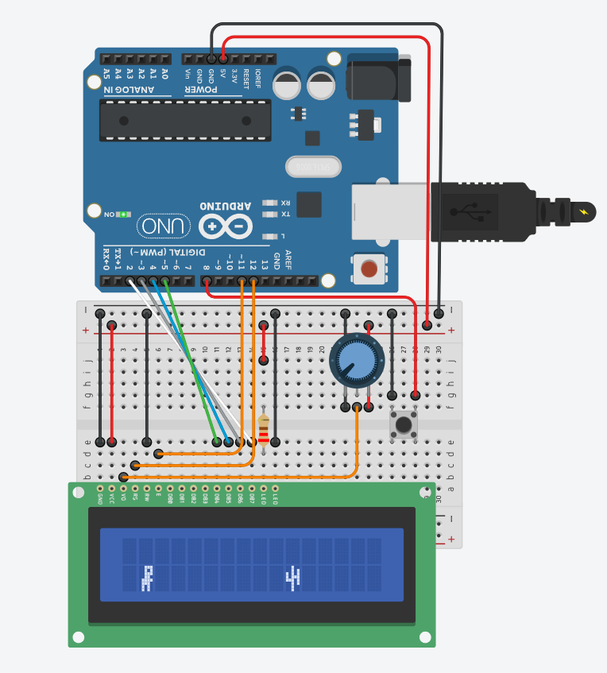

# Arduino LCD Dino Run Game

## Overview

This is a simple Dino Run-style game built using an Arduino Uno,
a 16x2 LCD display and a push button.

The dinosaur remains on the left side of the LCD while a cactus moves
from right to left. The player presses and holds the button to move the
dinosaur to the top row and avoid the cactus.

This was one of my early Arduino learning projects. I originally
developed it with AI assistance, then assembled and tested the hardware
and reviewed how the LCD, button input, custom characters, movement,
collision detection and score system work.

## Demonstration

A project demonstration video will be added here.

## Features

- Custom dinosaur character
- Custom cactus character
- Push-button jump control
- Moving obstacle
- Collision detection
- Score tracking
- Game-over screen

## Components Used

- Arduino Uno R3
- 16x2 LCD display
- Push button
- 10 kOhm potentiometer
- Breadboard
- Jumper wires
- 220 ohm resistor

## Pin Connections

### LCD Connections

| LCD Pin | Connection |
|---|---|
| VSS/GND | GND |
| VDD/VCC | 5V |
| V0 | Middle pin of potentiometer |
| RS | Arduino pin 12 |
| RW | GND |
| E | Arduino pin 11 |
| DB4 | Arduino pin 5 |
| DB5 | Arduino pin 4 |
| DB6 | Arduino pin 3 |
| DB7 | Arduino pin 2 |
| Led+ | 5V | (IMPORTANT - through a 220 ohm resistor)(for lcd backlight)
| Led- | GND | (for lcd backlight)

### Button Connections

| Button Side | Connection |
|---|---|
| Side 1 | Arduino pin 8 |
| Side 2 | GND |

The button uses the Arduino's internal pull-up resistor through
`INPUT_PULLUP`.

### Potentiometer connections
| Poteentiometer side | Connection |
|---|---|
| Side 1 | 5V |
| Side 2 | GND |

## How It Works

The program creates two custom LCD characters: a dinosaur and a cactus.

The cactus starts at the right side of the screen and moves one column
to the left during each game cycle.

When the button is pressed, the dinosaur is displayed on the top row.
When the button is released, the dinosaur is displayed on the bottom row.

If the cactus reaches the dinosaur while the dinosaur is on the bottom
row, the game ends and the score is displayed.

If the cactus passes across the screen successfully, the score increases
by one.

## Skills Practised

- Arduino C++ programming
- Digital inputs
- Internal pull-up resistors
- 16x2 LCD interfacing
- Custom LCD characters
- Basic collision logic
- Score tracking
- Breadboard prototyping
- Hardware testing

## Hardware Implementation

I constructed the project using an Arduino Uno R3, a 16x2 LCD,
a push button, a potentiometer, 220 ohm resistor, some jumper wires and a breadboard.

### Physical Prototype

### Circuit Schematic

[Open the complete schematic PDF](schematic/arduino_lcd_dino_game_schematic.pdf)

### Digital Working Model

## Source Code

The complete Arduino sketch is available below:

[View lcd_dino_game.ino](firmware/lcd_dino_game/lcd_dino_game.ino)

## Current Limitations

- The button must be held while jumping
- Short button presses may be missed
- The display may flicker because it is cleared repeatedly
- The button does not currently use software debouncing
- The score appears only after game over
- The game speed remains constant

## Planned Improvements

- Add a timed jump
- Add button debouncing
- Reduce LCD flickering
- Display the score during gameplay
- Add a start and restart screen
- Increase the difficulty as the score rises

## Version History

### v1.0.0 - Basic Version

- Initial playable version
- Custom dinosaur and cactus characters
- Push-button jump control
- Collision detection
- Score tracking

## Author

Harmanjeet Singh

Level 6 Diploma in Electronic Engineering student in New Zealand

LinkedIn: www.linkedin.com/in/harmanjeet-singh-engineer
